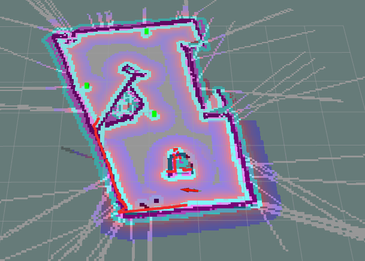

LARM - Moutarde - Challenge 3
=============================

The goal of the challenge is to demonstrate the capability the robot has to map an environment, to navigate it autonomously, and to retrieve specific objects in it.


Dependencies
------------

The project depends on [`mb6-tbot`](https://bitbucket.org/imt-mobisyst/mb6-tbot/)

The project depends on [`move_base`](http://wiki.ros.org/move_base) and [`dwa_local_planner`](http://wiki.ros.org/dwa_local_planner)
```bash
sudo apt install ros-noetic-move-base
sudo apt install ros-noetic-dwa-local-planner
```

The project depends on [`explore_lite`](http://wiki.ros.org/explore_lite)
```bash
sudo apt install ros-noetic-explore-lite
```

Autonomous navigation
---------------------

We decided to use `gmapping` and `move_base` from ROS's navigation stack in order for the robot to move autonomously in the arena. We also used the `dwa_local_planner` to replace move_base's default local planner as it works way better in our experience. We configured the global planner so that you can make the robot explore unknown areas, and it will adjust its path along the way as it detects new walls and obstacles. That way, you can make the robot explore its environment easily by sending it goals through Rviz, even if it does not know the map yet.

The global costmap is generated using gmapping's map. The obstacles are inflated by the radius of the robot. This is the area that the robot must not enter under any circumstances. Otherwise a collision will be unavoidable. This region is displayed in light blue in Rviz. The obstacles are further inflated, but this time with a gradient pattern: the closer the area is to an obstacle, the less likely global and local planners are to plan paths there. The local costmap does the exact same thing but takes its data from the laser and overrules the global costmap. That way the robot can react in real time to the obstacles. The two costmaps and the planned paths are displayed in Rviz.

`explore_lite` is a ROS package that works with move_base. It determines the best goal to go explore in order to map the environment in the most efficient way possible. The goals are sent to move_base and the robot keeps exploring until the whole environment has been mapped. As you will see, it works really well in the simulation, but we had trouble making it work in small cluttered places like the arena. That is why we only enabled it for the simulation.


Detection of the bottles in the image
-------------------------------------

To detect the bottles in an image from the camera, we trained a Haar cascade classifier.

Our model has been specically trained to recognize black bottles of Nuka Cola®. We used a Haar cascade classifier with Local Bynary Patterns (LBP). We trained the model using our own large data base containing about 200 positive images and 400 negative images that we took directly using the camera of the robot (intel realsense D435) to obtain images as close as possible to the images that will be seen by the robot (The script we used to generate these images can be seen in `training.py`). We tried a lot of different parameters, but our first attempt is the one that ended up working best.

  


Processing the data from the camera
-----------------------------------

First, the python script receives the color and depth images from the camera. They are converted into usable images objects using the `cv_bridge` library. Then, our model is applied to the color image using OpenCV to get the positions and sizes of all the bottles found in the picture. To find the distance between the camera and the bottle, we take a small rectangle in the middle of the bottle in the depth image (using the same position and size that have been found on the color image, but on the depth image, which has been aligned to the color image by the camera). We then take the median value of this small rectangle. This ensures that the calculated depth is not affected by extreme values, like some pixels from the background, or parasites. Finally, we add about half of the diameter of the bottle to the depth, to obtain the distance from the camera to the center of the bottle.

We now have the position of the bottle in the image, and its distance to the camera. Using the `CameraInfo` message that we get from the camera, and ROS's `image_geometry` library, we can calculate the ray (a point that only contains angular information, and no distance information. Basically a 3D point which is at a distance of 1) from the camera to the bottle. Multiplying this point by the previously calculated depth gives us the 3D coordinates of the bottle in the frame of the camera. The image_geometry library takes care of dealing with the camera's viewing angle and distortion, and gives us far more accurate results than if we had done the trigonometry calculations by hand.

The first verification that we do to filter out false alarms is to check if the size of the bottle is coherent.

Note: at this point, we know how many potential bottles are currently being seen by the camera. For visualization purposes, an image with blue rectangles arround the bottles is displayed in Rviz, and the robot turns on its LED (green if there is one bottle in the image, yellow if there are two, and red if there are three of more).

Lastly, the coordinates of the bottle in the frame of the camera are converted in coordinates in the frame of the map using the `TransformListener` and the transformation messages published on `/tf`

This process is explained in more details in the python script `bottle_detector.py`, in the `Node` class.


Keeping track of the bottles in the map
---------------------------------------

The `Bottle` class contains all the code used to keep track of the position of the bottles.

For each image sent by the camera, the main class passes the list of points it found to the Bottle class. For each point, if a bottle that is close already exists, it is updated: its coordinates are adjusted by taking the average of the five last values. Otherwise, it is created. A newly created bottle has to be detected and updated enough times before it is considered to actually exist. It is then marked as listed. Similarily, if a bottle that is not listed is not detected for too long, it is considered to be a false alarm and is destroyed, without having been published.

Each time a bottle is marked as listed, a new marker is sent on the `/bottle` topic to Rviz and displayed. Moreover, a sound id played by the robot. By default, when a bottle is updated, the marker is updated too, so that Rviz can display it at the correct place: it is re-published with the SAME ID, so that Rviz knows not to place a new one. If you would prefer each marker to be published only one time, you can change the `publish_updates` variable to `False` in the `bottle_detector.py` script.

The distance tolerence under which a bottle is considered to already exist is fairly high, so that one bottle won't be placed several times at the same spot. So, to accomodate for two or more bottles that may be close to each other, several bottles detected in the same picture will necessarily be treated as different bottles by the program, even if they are clother to each other than the distance tolerance.

This process is explained in more details in the python script `bottle_detector.py`, in the `Bottle` class. There, the parameters can also be modified, and an explanation of each of them is provided.

The list of bottles can be obtained by typing the following command in a terminal:
```bash
rosservice call /print_bottles
```
You should get an answer like
```
success: True
message: "3 bottle(s) [2.001 -0.349 0.105] [-0.09 1.545 0.114] [-1.354 -0.849 0.128] "
```




Handling ROS time
-----------------

When processing the data received from the camera, we needed to make sure that we used a color and depth image that were taken at the same time, otherwise the rectangle found in the color image would not be exactly in the same spot in the depth image, especially when the robot is turning, which is a problem that we had at the beginning. To solve that, we used the `TimeSynchronizer` class from ROS's `message_filters` library. This provides a buffer the the messages we want to listen to, in our case the color image, the depth image and the camera info, and calls the callback only once three messages with the same timestamp are available.

When doing the transformation from the camera frame to the map frame, we use a `PointStamped` object with the same timestamp as the image. That way, even even if the reception of the messages or the computation takes time, and even if the robot has already moved by the time the point has been calculated, the transformed point will still have accurate coordinates. This is thanks to the `TransformListener` which provades a small buffer for the `/tf` transforms, and is able to lookup for transformations in the past.


Avoiding the bottles when navigating
------------------------------------

The bottles are too small to be detected by the laser. That means that the robot would drive over them if they were in the middle of the arena. To prevent this from happening, the `bottle_detector.py` node continuously publishes all the listed bottles on the `bottle_obstacles` topic as a `PointCloud` message with the current timestamp. As you can see in the `costmap_common_params.yaml` parameter file, move_base listens to this topic so that the local and global planners can avoid the bottles.

Note: The coordinates are converted back is the `base_footprint` frame before being sent, because move_base assumes that this topic contains sensor data, and uses raytracing to place the obstacles on the map. The origin of the frame must therefore be in the local costmap, which is why we could not use the map frame.


Optionnal Features
------------------

1. The robot detect 2d-version-bottle (black one).

We trained our model with black bottles, so it only detects the black bottles. See the "Detection in the image" paragraph.

2. There is no need to publish goal positions. The robot is autonomous to achieve its mission.

This works in the simulation, but we still have to publish goal positions when using the real robot.

3. Any suggestions provided by the group are welcome.

All of the features that we implemented have been described in the previous paragraphs.